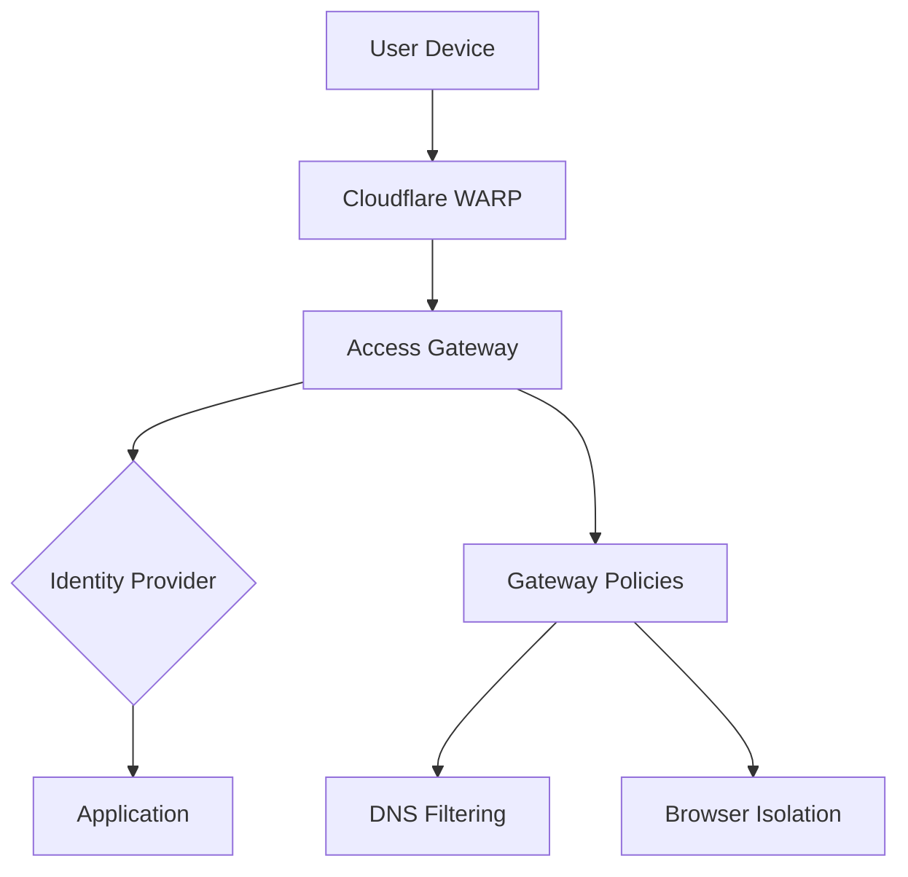

## Overview

Cloudflare's Zero Trust platform replaces the traditional perimeter-based security model with identity-aware access controls.

### Architecture

The Zero Trust model operates on three core principles:

1. **Verify Explicitly** — Authenticate and authorize based on all available data points
2. **Use Least Privilege** — Limit user access with Just-In-Time and Just-Enough-Access
3. **Assume Breach** — Minimize blast radius and segment access

### Key Components

### DNS Filtering

Cloudflare Gateway provides DNS-layer security that blocks:

- Malware domains
- Phishing sites
- Command & control servers
- Content categories

This operates at the DNS resolution level, meaning protection applies before any connection is established.
