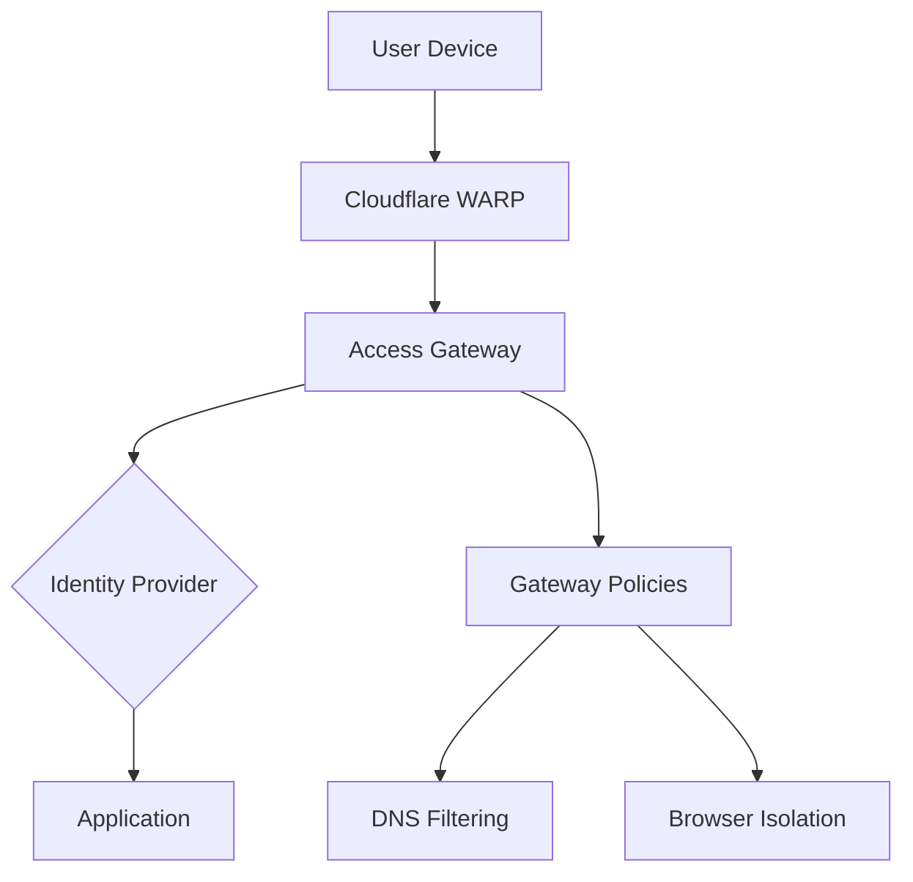

## 概览

Cloudflare Zero Trust 平台以身份感知的访问控制，替代传统依赖网络边界的安全模型。

### 架构原则

零信任模型围绕三个核心原则展开：

1. **显式验证**：结合可用的上下文信息进行身份认证与授权。
2. **最小权限**：通过即时、按需授权，限制用户的访问范围。
3. **假设已被入侵**：限制影响范围，对访问进行分段。

### 关键组件

```mermaid
graph TD
    A[User Device] --> B[Cloudflare WARP]
    B --> C[Access Gateway]
    C --> D{Identity Provider}
    D --> E[Application]
    C --> F[Gateway Policies]
    F --> G[DNS Filtering]
    F --> H[Browser Isolation]
```

### DNS 过滤

Cloudflare Gateway 在 DNS 层提供安全过滤，可拦截：

- 恶意软件域名
- 钓鱼网站
- 命令与控制服务器
- 指定内容类别

这些策略作用于 DNS 解析阶段，在建立后续连接前执行过滤。
